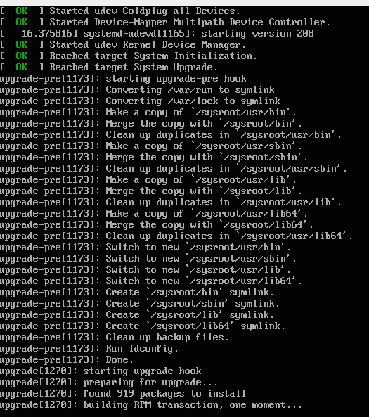
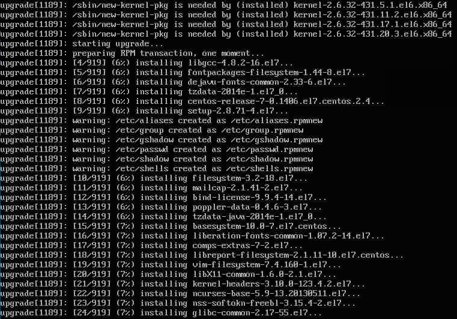
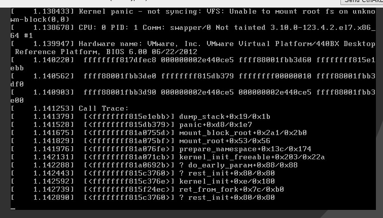
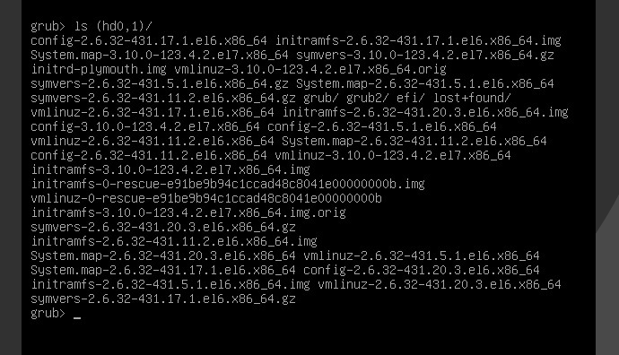
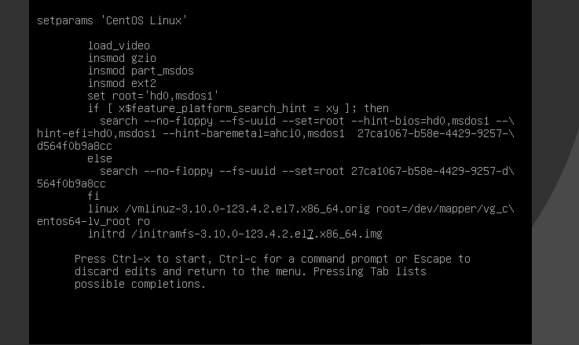

do the CENTOS 6.5 to 7.0 Upgrade

Download all the necessary packages:

	elatov@ccl:~$mkdir up; up/
	elatov@ccl:~/up$ wget http://dev.centos.org/centos/6/upg/x86_64/Packages/preupgrade-assistant-1.0.2-33.el6.x86_64.rpm
	elatov@ccl:~/up$wget http://dev.centos.org/centos/6/upg/x86_64/Packages/preupgrade-assistant-contents-0.5.13-1.el6.noarch.rpm
	elatov@ccl:~/up$wget http://dev.centos.org/centos/6/upg/x86_64/Packages/preupgrade-assistant-ui-1.0.2-33.el6.x86_64.rpm
	elatov@ccl:~/up$wget http://dev.centos.org/centos/6/upg/x86_64/Packages/python-rhsm-1.9.7-1.el6.x86_64.rpm
	elatov@ccl:~/up$wget http://dev.centos.org/centos/6/upg/x86_64/Packages/redhat-upgrade-tool-0.7.22-1.el6.noarch.rpm

At the end we should have the following files:

	elatov@ccl:~/up$ls
	preupgrade-assistant-1.0.2-33.el6.x86_64.rpm
	preupgrade-assistant-contents-0.5.13-1.el6.noarch.rpm
	preupgrade-assistant-ui-1.0.2-33.el6.x86_64.rpm
	python-rhsm-1.9.7-1.el6.x86_64.rpm
	redhat-upgrade-tool-0.7.22-1.el6.noarch.rpm

Now let’s install the pre upgrade checker:

	elatov@ccl:~/up$ sudo yum localinstall preupgrade-assistant-*

And let’s import the new GPG key:

	elatov@ccl:~/up$sudo rpm --import http://ftp.plusline.de/centos/7.0.1406/os/x86_64/RPM-GPG-KEY-CentOS-7
	
Now let's run the tool:

	elatov@ccl:~$sudo preupg
	Preupg tool doesn't do the actual upgrade.
	Please ensure you have backed up your system and/or data in the event of a failed upgrade that would require a full re-install of the system from installation media.
	Do you want to continue? y/n
	y
	Gathering logs used by preupgrade assistant:
	All installed packages : 01/10 ...finished (time 00:00s)
	All changed files      : 02/10 ...finished (time 12:19s)
	Changed config files   : 03/10 ...finished (time 00:00s)
	All users              : 04/10 ...finished (time 00:00s)
	All groups             : 05/10 ...finished (time 00:00s)
	Service statuses       : 06/10 ...finished (time 00:00s)
	All installed files    : 07/10 ...finished (time 00:03s)
	All local files        : 08/10 ...finished (time 01:10s)
	All executable files   : 09/10 ...finished (time 00:05s)
	RedHat signed packages : 10/10 ...finished (time 00:00s)
	Assessment of the system, running checks / SCE scripts:
	001/100 ...done    (Configuration Files to Review)
	002/100 ...done    (File Lists for Manual Migration)
	003/100 ...done    (Bacula Backup Software)
	004/100 ...done    (MySQL configuration)
	005/100 ...done    (Migration of the MySQL data stack)
	006/100 ...done    (General changes in default MySQL implementation)
	007/100 ...done    (PostgreSQL upgrade content)
	008/100 ...done    (GNOME Desktop Environment underwent several design modifications in Red Hat Enterprise Linux 7 release)
	009/100 ...done    (KDE Desktop Environment underwent several design modifications in Red Hat Enterprise Linux 7 release)
	010/100 ...done    (several graphic drivers not supported in Red Hat Enterprise Linux 7)
	011/100 ...done    (several input drivers not supported in Red Hat Enterprise Linux 7)
	012/100 ...done    (several kernel networking drivers not available in Red Hat Enterprise Linux 7)
	013/100 ...done    (several kernel storage drivers not available in Red Hat Enterprise Linux 7)
	014/100 ...done    (Names, Options and Output Format Changes in arptables)
	015/100 ...done    (BIND9 running in a chroot environment check.)
	016/100 ...done    (BIND9 configuration compatibility check)
	017/100 ...done    (Move dhcpd/dhcprelay arguments from /etc/sysconfig/* to *.service files)
	018/100 ...done    (DNSMASQ configuration compatibility check)
	019/100 ...done    (Dovecot configuration compatibility check)
	020/100 ...done    (Compatibility Between iptables and ip6tables)
	021/100 ...done    (Net-SNMP check)
	022/100 ...done    (Squid configuration compatibility check)
	023/100 ...done    (Reusable Configuration Files)
	024/100 ...done    (VCS repositories)
	025/100 ...done    (Added and extended options for BIND9 configuration)
	026/100 ...done    (Added options in DNSMASQ configuration)
	027/100 ...done    (Packages not signed by Red Hat)
	028/100 ...done    (Obsoleted rpms)
	029/100 ...done    (w3m not available in Red Hat Enterprise Linux 7)
	030/100 ...done    (report incompatibilities between Red Hat Enterprise Linux 6 and 7 in qemu-guest-agent package)
	031/100 ...done    (Removed options in coreutils binaries)
	032/100 ...done    (Removed options in gawk binaries)
	033/100 ...done    (Removed options in netstat binary)
	034/100 ...done    (Removed options in quota tools)
	035/100 ...done    (Removed rpms)
	036/100 ...done    (Replaced rpms)
	037/100 ...done    (GMP library incompatibilities)
	038/100 ...done    (optional channel problems)
	039/100 ...done    (package downgrades)
	040/100 ...done    (restore custom selinux configuration)
	041/100 ...done    (General)
	042/100 ...done    (samba shared directories selinux)
	043/100 ...done    (CUPS Browsing/BrowsePoll configuration)
	044/100 ...done    (CVS Package Split)
	045/100 ...done    (FreeRADIUS Upgrade Verification)
	046/100 ...done    (httpd configuration compatibility check)
	047/100 ...done    (bind-dyndb-ldap)
	048/100 ...done    (Identity Management Server compatibility check)
	049/100 ...done    (IPA Server CA Verification)
	050/100 ...done    (NTP configuration)
	051/100 ...done    (Information on time-sync.target)
	052/100 ...done    (OpenLDAP /etc/sysconfig and data compatibility)
	053/100 ...done    (OpenSSH sshd_config migration content)
	054/100 ...done    (OpenSSH sysconfig migration content)
	055/100 ...done    (Configuration for quota_nld service)
	056/100 ...done    (Disk quota netlink message daemon moved into quota-nld package)
	057/100 ...done    (SSSD compatibility check)
	058/100 ...done    (Luks encrypted partition)
	059/100 ...done    (Clvmd and cmirrord daemon management.)
	060/100 ...done    (State of LVM2 services.)
	061/100 ...done    (device-mapper-multipath configuration compatibility check)
	062/100 ...done    (Removal of scsi-target-utils)
	063/100 ...done    (Configuration for warnquota tool)
	064/100 ...done    (Disk quota tool warnquota moved into quota-warnquota package)
	065/100 ...done    (Check for Add-On availability)
	066/100 ...done    (Architecture Support)
	067/100 ...done    (Binary rebuilds)
	068/100 ...done    (Debuginfo packages)
	069/100 ...done    (Cluster and High Availablility)
	070/100 ...done    (fix krb5kdc config file)
	071/100 ...done    (File Systems, Partitions and Mounts Configuration Review)
	072/100 ...done    (Read Only FHS directories)
	073/100 ...done    (Red Hat Enterprise Linux Server variant)
	074/100 ...done    (Sonamebumped libs)
	075/100 ...done    (SonameKept Reusable Dynamic Libraries)
	076/100 ...done    (Removed .so libs)
	077/100 ...done    (In-place Upgrade Requirements for the /usr/ Directory)
	078/100 ...done    (CA certificate bundles modified)
	079/100 ...done    (Developer Tool Set packages)
	080/100 ...done    (Hyper-V)
	081/100 ...done    (Content for enabling and disabling services based on RHEL 6 system)
	082/100 ...done    (Check for ethernet interface naming)
	083/100 ...done    (User modification in /etc/rc.local and /etc/rc.d/rc.local)
	084/100 ...done    (cgroups configuration compatibility check)
	085/100 ...done    (Plugable authentication modules (PAM))
	086/100 ...done    (Foreign Perl modules)
	087/100 ...done    (Python 2.7.5)
	088/100 ...done    (Ruby 2.0.0)
	089/100 ...done    (SCL collections)
	090/100 ...done    (Red Hat Subscription Manager)
	091/100 ...done    (Red Hat Network Classic Unsupported)
	092/100 ...done    (System kickstart)
	093/100 ...done    (YUM)
	094/100 ...done    (Check for usage of dangerous range of UID/GIDs)
	095/100 ...done    (Incorrect usage of reserved UID/GIDs)
	096/100 ...done    (NIS ypbind config files back-up)
	097/100 ...done    (NIS Makefile back-up)
	098/100 ...done    (NIS server maps check)
	099/100 ...done    (NIS server MAXUID and MAXGID limits check)
	100/100 ...done    (NIS server config file back-up)
	Assessment finished (time 00:30s)
	Result table with checks and their results for main contents:
	-----------------------------------------------------------------
	|Configuration Files to Review                  |notapplicable  |
	|File Lists for Manual Migration                |notapplicable  |
	|Bacula Backup Software                         |notapplicable  |
	|MySQL configuration                            |notapplicable  |
	|Migration of the MySQL data stack              |notapplicable  |
	|General changes in default MySQL implementation |notapplicable  |
	|PostgreSQL upgrade content                      |notapplicable  |
	|GNOME Desktop Environment underwent several design modifications in Red Hat Enterprise Linux 7 release      |notapplicable  |
	|KDE Desktop Environment underwent several design modifications in Red Hat Enterprise Linux 7 release        |notapplicable  |
	|several graphic drivers not supported in Red Hat Enterprise Linux 7                                         |notapplicable  |
	|several input drivers not supported in Red Hat Enterprise Linux 7                                           |notapplicable  |
	|several kernel networking drivers not available in Red Hat Enterprise Linux 7                               |notapplicable  |
	|several kernel storage drivers not available in Red Hat Enterprise Linux 7                                  |notapplicable  |
	|Names, Options and Output Format Changes in arptables |notapplicable  |
	|BIND9 running in a chroot environment check.       |notapplicable  |
	|BIND9 configuration compatibility check            |notapplicable  |
	|Move dhcpd/dhcprelay arguments from /etc/sysconfig/* to *.service files                                     |notapplicable  |
	|DNSMASQ configuration compatibility check          |notapplicable  |
	|Dovecot configuration compatibility check          |notapplicable  |
	|Compatibility Between iptables and ip6tables       |notapplicable  |
	|Net-SNMP check                                     |notapplicable  |
	|Squid configuration compatibility check            |notapplicable  |
	|Reusable Configuration Files                       |notapplicable  |
	|VCS repositories                                   |notapplicable  |
	|Added and extended options for BIND9 configuration |notapplicable  |
	|Added options in DNSMASQ configuration             |notapplicable  |
	|Packages not signed by Red Hat                     |notapplicable  |
	|Obsoleted rpms                                     |notapplicable  |
	|w3m not available in Red Hat Enterprise Linux 7    |notapplicable  |
	|report incompatibilities between Red Hat Enterprise Linux 6 and 7 in qemu-guest-agent package               |notapplicable  |
	|Removed options in coreutils binaries              |notapplicable  |
	|Removed options in gawk binaries                   |notapplicable  |
	|Removed options in netstat binary                  |notapplicable  |
	|Removed options in quota tools                     |notapplicable  |
	|Removed rpms                                       |notapplicable  |
	|Replaced rpms                                      |notapplicable  |
	|GMP library incompatibilities                      |notapplicable  |
	|optional channel problems                          |notapplicable  |
	|package downgrades                                 |notapplicable  |
	|restore custom selinux configuration               |notapplicable  |
	|General                                            |notapplicable  |
	|samba shared directories selinux                   |notapplicable  |
	|CUPS Browsing/BrowsePoll configuration             |notapplicable  |
	|CVS Package Split                                  |notapplicable  |
	|FreeRADIUS Upgrade Verification                    |notapplicable  |
	|httpd configuration compatibility check            |notapplicable  |
	|bind-dyndb-ldap                                    |notapplicable  |
	|Identity Management Server compatibility check     |notapplicable  |
	|IPA Server CA Verification                         |notapplicable  |
	|NTP configuration                                  |notapplicable  |
	|Information on time-sync.target                    |notapplicable  |
	|OpenLDAP /etc/sysconfig and data compatibility     |notapplicable  |
	|OpenSSH sshd_config migration content              |notapplicable  |
	|OpenSSH sysconfig migration content                |notapplicable  |
	|Configuration for quota_nld service                |notapplicable  |
	|Disk quota netlink message daemon moved into quota-nld package                                              |notapplicable  |
	|SSSD compatibility check                           |notapplicable  |
	|Luks encrypted partition                           |notapplicable  |
	|Clvmd and cmirrord daemon management.              |notapplicable  |
	|State of LVM2 services.                            |notapplicable  |
	|device-mapper-multipath configuration compatibility check                                                   |notapplicable  |
	|Removal of scsi-target-utils                       |notapplicable  |
	|Configuration for warnquota tool                   |notapplicable  |
	|Disk quota tool warnquota moved into quota-warnquota package                                                |notapplicable  |
	|Check for Add-On availability                      |notapplicable  |
	|Architecture Support                               |notapplicable  |
	|Binary rebuilds                                    |notapplicable  |
	|Debuginfo packages                                 |notapplicable  |
	|Cluster and High Availablility                     |notapplicable  |
	|fix krb5kdc config file                            |notapplicable  |
	|File Systems, Partitions and Mounts Configuration Review                                                    |notapplicable  |
	|Read Only FHS directories                          |notapplicable  |
	|Red Hat Enterprise Linux Server variant            |notapplicable  |
	|Sonamebumped libs                                  |notapplicable  |
	|SonameKept Reusable Dynamic Libraries              |notapplicable  |
	|Removed .so libs                                   |notapplicable  |
	|In-place Upgrade Requirements for the /usr/ Directory                                                       |notapplicable  |
	|CA certificate bundles modified                    |notapplicable  |
	|Developer Tool Set packages                        |notapplicable  |
	|Hyper-V                                            |notapplicable  |
	|Content for enabling and disabling services based on RHEL 6 system                                          |notapplicable  |
	|Check for ethernet interface naming                |notapplicable  |
	|User modification in /etc/rc.local and /etc/rc.d/rc.local                                                   |notapplicable  |
	|cgroups configuration compatibility check          |notapplicable  |
	|Plugable authentication modules (PAM)              |notapplicable  |
	|Foreign Perl modules                               |notapplicable  |
	|Python 2.7.5                                       |notapplicable  |
	|Ruby 2.0.0                                         |notapplicable  |
	|SCL collections                                    |notapplicable  |
	|Red Hat Network Classic Unsupported                |notapplicable  |
	|Red Hat Subscription Manager                       |notapplicable  |
	|System kickstart                                   |notapplicable  |
	|YUM                                                |notapplicable  |
	|Check for usage of dangerous range of UID/GIDs     |notapplicable  |
	|Incorrect usage of reserved UID/GIDs               |notapplicable  |
	|NIS ypbind config files back-up                    |notapplicable  |
	|NIS Makefile back-up                               |notapplicable  |
	|NIS server maps check                              |notapplicable  |
	|NIS server MAXUID and MAXGID limits check          |notapplicable  |
	|NIS server config file back-up                     |notapplicable  |
	---------------------------------------------------------------------
	Tarball with results is stored here /root/preupgrade-results/preupg_results-140716165419.tar.gz .
	The latest assessment is stored in directory /root/preupgrade .
	Upload results to UI by command:
	e.g. preupg -u http://127.0.0.1:8099/submit/ -r /root/preupgrade-results/preupg_results-*.tar.gz .
	
Now let's install the actual upgrade tool:

	elatov@ccl:~/up$sudo yum localinstall redhat-upgrade-tool-0.7.22-1.el6.noarch.rpm python-rhsm-1.9.7-1.el6.x86_64.rpm

After that screen your session if you want, when I ran the command the first time, I saw the following:

	elatov@ccl:~$sudo redhat-upgrade-tool-cli --instrepo=http://mirror.bytemark.co.uk/centos/7/os/x86_64/ --network=7 --disablerepo=epel --disablerepo=rpmforge --disablerepo=atomic
	setting up repos...
	base                        | 3.6 kB     00:00 
	base/primary_db             | 4.9 MB     00:00
	cmdline-instrepo            | 3.6 kB     00:00
	cmdline-instrepo/primary_db | 4.9 MB     00:01
	extras                      | 3.3 kB     00:00
	extras/primary_db           |  15 kB     00:00
	updates                     | 3.4 kB     00:00
	updates/primary_db          | 1.5 MB     00:00
	.treeinfo                   | 1.1 kB     00:00
	preupgrade-assistant has not been run.
	To perform this upgrade, either run preupg or run redhat-upgrade-tool --force

So let's try to force it:

	elatov@ccl:~$sudo redhat-upgrade-tool-cli --instrepo=http://mirror.bytemark.co.uk/centos/7/os/x86_64/ --network=7 --disablerepo=epel --disablerepo=rpmforge --disablerepo=atomic --disablerepo=lemonldap-ng --disablerepo=security_shibboleth --force
	setting up repos...
	.treeinfo  							| 1.1 kB     00:00
	getting boot images...
	vmlinuz-redhat-upgrade-tool 		| 4.7 MB     00:01
	initramfs-redhat-upgrade-tool.img 	|  32 MB     00:02
	setting up update...
	finding updates 25% [=============]
	base/filelists_db 					| 5.8 MB     00:00
	cmdline-instrepo/filelists_db 		| 5.8 MB     00:02
	extras/filelists_db 				|  38 kB     00:00
	updates/filelists_db

If you want you can check out the logs from here:

	elatov@ccl:~$ tail /var/log/redhat_upgrade_tool.log
	[   278.365] (II) redhat_upgrade_tool.yum:build_update_transaction()     openscap-1.0.8-1.el6_5.x86_64 requires libpcre.so.0()(64bit)
	[   278.365] (II) redhat_upgrade_tool.yum:build_update_transaction()     perl-Log-Dispatch-FileRotate-1.19-4.el6.noarch requires perl(:MODULE_COMPAT_5.10.1)
	[   278.365] (II) redhat_upgrade_tool.yum:build_update_transaction()     1:python-BeautifulSoup-3.0.8.1-1.el6.noarch requires python(abi) = 2.6
	[   278.365] (II) redhat_upgrade_tool.yum:build_update_transaction()     openscap-1.0.8-1.el6_5.x86_64 requires librpmio.so.1()(64bit)
	[   278.365] (II) redhat_upgrade_tool.yum:build_update_transaction()     python-six-1.6.1-1.el6.noarch requires python(abi) = 2.6
	[   278.365] (II) redhat_upgrade_tool.yum:build_update_transaction()     perl-Config-IniFiles-2.72-2.el6.noarch requires perl(:MODULE_COMPAT_5.10.1)
	[   278.365] (II) redhat_upgrade_tool.yum:build_update_transaction()     pysvn-1.7.6-1.el6.x86_64 requires python(abi) = 2.6
	[   278.365] (II) redhat_upgrade_tool.yum:build_update_transaction()     mod_perl-2.0.4-11.el6_5.x86_64 requires httpd-mmn = 20051115
	[   278.399] (II) redhat_upgrade_tool.yum:clean_cache() checking for unneeded rpms in cache
	[   278.551] (II) redhat_upgrade_tool.yum:download_packages() beginning package download...

Oh and make sure you at least have 1.1G free, if you don't you will receive the following warning:

	Upgrade test failed with the following problems:
	insufficient disk space:
	  / needs 1.1G more free space
	rpm transaction 100% [========]
	elatov@ccl:~$

If all is well you should see the following:

	testing upgrade transaction
	rpm transaction 100% [====]
	rpm install 100% [====]
	setting up system for upgrade
	Finished. Reboot to start upgrade.
	
	
After I restarted the upgrade process started:

### Post Upgrade issues
I ran into a couple.

#### Networking Device Name Change

After the update was done, my network didn't come up. The problem was that my ethernet device had a different name:

	[root@ccl ~]# ip link
	1: lo: <LOOPBACK,UP,LOWER_UP> mtu 65536 qdisc noqueue state UNKNOWN mode DEFAULT
	   link/loopback 00:00:00:00:00:00 brd 00:00:00:00:00:00
	2: ens192: <BROADCAST,MULTICAST> mtu 1500 qdisc noop state DOWN mode DEFAULT qlen 1000
	   link/ether 00:50:56:89:57:0c brd ff:ff:ff:ff:ff:ff

To fix it, I ran the following to clear out the udev rules:

	[root@ccl ~]# cp /etc/udev/rules.d/70-persistent-net.rules /backup/.
	[root@ccl ~]# > /etc/udev/rules.d/70-persistent-net.rules

Then I fixed up the network script:

	[root@ccl ~]# mv /etc/sysconfig/network-scripts/ifcfg-eth0 /etc/sysconfig/network-scripts/ifcfg-ens192
	[root@ccl ~]# grep -i dev /etc/sysconfig/network-scripts/ifcfg-ens192
	DEVICE=ens192

#### systemd-fsck in initramfs order
Then after a restart the networking was okay. I then saw the following during boot:

	Starting File System Check on /dev/mapper/vg_centos64-lv_root...
	systemd-fsck[261]: fsck: error 2 (No such file or directory) while executing fsck.ext2 for /dev/mapper/vg_centos64-lv_root

But the machine would actually boot. Logging into the system and checking the status of the service:

	[root@ccl ~]# systemctl status systemd-fsck-root -l
	systemd-fsck-root.service - File System Check on Root Device
	   Loaded: loaded (/usr/lib/systemd/system/systemd-fsck-root.service; static)
	   Active: active (exited) since Thu 2014-07-17 09:57:52 MDT; 17min ago
	     Docs: man:systemd-fsck-root.service(8)
	  Process: 390 ExecStart=/usr/lib/systemd/systemd-fsck (code=exited, status=0/SUCCESS)
	 Main PID: 390 (code=exited, status=0/SUCCESS)
	
	Jul 17 09:57:52 ccl.dnsd.me systemd-fsck[390]: /dev/mapper/vg_centos64-lv_root: clean, 178713/494832 files, 1270686/1976320 blocks
	Jul 17 09:57:52 ccl.dnsd.me systemd[1]: Started File System Check on Root Device.
	[root@ccl ~]#

It looked good. There is an RHEL [page](https://access.redhat.com/solutions/971793) on it, but without a subscription I couldn't see what the solution was. 

I checked out the man page for **systemd-fsck** and I saw the following:

> systemd-fsck@.service and systemd-fsck-root.service are services responsible for file system checks. They are instantiated for each device that is configured for file system checking. systemd-fsck-root.service is responsible for file system checks on the root file system, but in only if the root filesystem wasn't checked in the initramfs. systemd-fsck@.service is used for all other file systems and for the root file system in the initramfs.

This gave me the hint that the *initramfs* doesn't have the **fsck.ext2** binary. Checking out the boot image:

	elatov@ccl:~$sudo lsinitrd | grep fsck
	Image: /boot/initramfs-3.10.0-123.4.2.el7.x86_64.img: 11M
	========================================================================
	dracut-033-161.el7 with dracut modules:
	-rw-r--r--   1 root     root          112 Mar 11 12:36 etc/e2fsck.conf
	-rwxr-xr-x   1 root     root        44880 Jul 17 09:43 usr/lib/systemd/systemd-fsck
	-rw-r--r--   1 root     root          682 Jun  9 23:35 usr/lib/systemd/system/systemd-fsck@.service
	-rwxr-xr-x   2 root     root            0 Jul 17 09:43 usr/sbin/e2fsck
	-rwxr-xr-x   1 root     root        32864 Jul 17 09:43 usr/sbin/fsck
	-rwxr-xr-x   2 root     root       256312 Jul 17 09:43 usr/sbin/fsck.ext4

So let's insert the binary into the initramfs image:

Checking out the dracut config (**/etc/dracut.conf**), which is used to build the initrd and kernel images, I saw the following:

> # A list of fsck tools to install. If it's not specified, module's hardcoded
> # default is used, currently: "umount mount /sbin/fsck* xfs_db xfs_check
> # xfs_repair e2fsck jfs_fsck reiserfsck btrfsck". The installation is
> # opportunistic, so non-existing tools are just ignored.
> #fscks=""

It looks like **/sbin/fsck*** should be included by default. Checking out the current system, I saw the following:

	elatov@ccl:~$ls /sbin/fsck*
	/sbin/fsck         /sbin/fsck.ext2  /sbin/fsck.ext4   /sbin/fsck.xfs
	/sbin/fsck.cramfs  /sbin/fsck.ext3  /sbin/fsck.minix

So let's make a copy of the initramfs :

	elatov@ccl:/boot$sudo cp initramfs-3.10.0-123.4.2.el7.x86_64.img initramfs-3.10.0-123.4.2.el7.x86_64.img.orig
	elatov@ccl:/boot$sudo cp vmlinuz-3.10.0-123.4.2.el7.x86_64 vmlinuz-3.10.0-123.4.2.el7.x86_64.orig
	
Then I added the **fscks** parameter in **/etc/dracut.conf** to look like this (this way I knew which binaries would be included):

	elatov@ccl:~$grep fscks /etc/dracut.conf
	fscks="umount mount /sbin/fsck* xfs_db xfs_check xfs_repair e2fsck jfs_fsck reiserfsck btrfsck"

Now let's rebuild the image:

	elatov@ccl:~$sudo dracut -f -v
	Executing: /sbin/dracut -f -v
	*** Including module: bash ***
	*** Including module: i18n ***
	*** Including module: drm ***
	*** Including module: plymouth ***
	*** Including module: dm ***
	Skipping udev rule: 64-device-mapper.rules
	Skipping udev rule: 60-persistent-storage-dm.rules
	Skipping udev rule: 55-dm.rules
	*** Including module: kernel-modules ***
	*** Including module: lvm ***
	Skipping udev rule: 64-device-mapper.rules
	Skipping udev rule: 56-lvm.rules
	Skipping udev rule: 60-persistent-storage-lvm.rules
	*** Including module: resume ***
	*** Including module: rootfs-block ***
	*** Including module: terminfo ***
	*** Including module: udev-rules ***
	Skipping udev rule: 91-permissions.rules
	*** Including module: systemd ***
	*** Including module: usrmount ***
	*** Including module: base ***
	*** Including module: fs-lib ***
	*** Including module: shutdown ***
	*** Including modules done ***
	Failed to install module vmxnet
	*** Installing kernel module dependencies and firmware ***
	*** Installing kernel module dependencies and firmware done ***
	*** Resolving executable dependencies ***
	*** Resolving executable dependencies done***
	*** Hardlinking files ***
	*** Hardlinking files done ***
	*** Stripping files ***
	*** Stripping files done ***
	*** Generating early-microcode cpio image ***
	*** Creating image file ***
	*** Creating image file done ***

Now looking at the new image, I see the **fsck.ext2** and the **lvm** files in there:

	elatov@ccl:~$sudo lsinitrd | grep -E 'fsck|lvm'
	lvm
	-rw-r--r--   1 root     root          112 Mar 11 12:36 etc/e2fsck.conf
	drwxr-xr-x   2 root     root            0 Jul 17 12:21 etc/lvm
	-rw-r--r--   1 root     root        49038 Jul 17 12:21 etc/lvm/lvm.conf
	-rw-r--r--   1 root     root          776 Sep 12  2013 etc/udev/rules.d/64-lvm.rules
	-r-xr-xr-x   1 root     root        11312 Jul 17 12:21 usr/lib64/device-mapper/libdevmapper-event-lvm2mirror.so
	-r-xr-xr-x   1 root     root        11264 Jul 17 12:21 usr/lib64/device-mapper/libdevmapper-event-lvm2raid.so
	-r-xr-xr-x   1 root     root        11416 Jul 17 12:21 usr/lib64/device-mapper/libdevmapper-event-lvm2snapshot.so
	-r-xr-xr-x   1 root     root        15552 Jul 17 12:21 usr/lib64/device-mapper/libdevmapper-event-lvm2thin.so
	lrwxrwxrwx   1 root     root           46 Jul 17 12:21 usr/lib64/libdevmapper-event-lvm2mirror.so -> device-mapper/libdevmapper-event-lvm2mirror.so
	lrwxrwxrwx   1 root     root           44 Jul 17 12:21 usr/lib64/libdevmapper-event-lvm2raid.so -> device-mapper/libdevmapper-event-lvm2raid.so
	lrwxrwxrwx   1 root     root           48 Jul 17 12:21 usr/lib64/libdevmapper-event-lvm2snapshot.so -> device-mapper/libdevmapper-event-lvm2snapshot.so
	-r-xr-xr-x   1 root     root        11320 Jul 17 12:21 usr/lib64/libdevmapper-event-lvm2.so.2.02
	lrwxrwxrwx   1 root     root           44 Jul 17 12:21 usr/lib64/libdevmapper-event-lvm2thin.so -> device-mapper/libdevmapper-event-lvm2thin.so
	-r-xr-xr-x   1 root     root      1162760 Jul 17 12:21 usr/lib64/liblvm2cmd.so.2.02
	-rwxr-xr-x   1 root     root          593 Sep 12  2013 usr/lib/dracut/hooks/cmdline/30-parse-lvm.sh
	-rwxr-xr-x   1 root     root        44880 Jul 17 12:21 usr/lib/systemd/systemd-fsck
	-rw-r--r--   1 root     root          682 Jun  9 23:35 usr/lib/systemd/system/systemd-fsck@.service
	-r--r--r--   1 root     root         2454 Jun  9 13:38 usr/lib/udev/rules.d/11-dm-lvm.rules
	-r--r--r--   1 root     root         4125 Jul 17 12:21 usr/lib/udev/rules.d/69-dm-lvm-metad.rules
	-rwxr-xr-x   4 root     root            0 Jul 17 12:21 usr/sbin/e2fsck
	-rwxr-xr-x   1 root     root        32864 Jul 17 12:21 usr/sbin/fsck
	-rwxr-xr-x   1 root     root        20024 Jul 17 12:21 usr/sbin/fsck.cramfs
	-rwxr-xr-x   4 root     root            0 Jul 17 12:21 usr/sbin/fsck.ext2
	-rwxr-xr-x   4 root     root            0 Jul 17 12:21 usr/sbin/fsck.ext3
	-rwxr-xr-x   4 root     root       256312 Jul 17 12:21 usr/sbin/fsck.ext4
	-rwxr-xr-x   1 root     root        70896 Jul 17 12:21 usr/sbin/fsck.minix
	-rwxr-xr-x   1 root     root          433 Jun  9 19:59 usr/sbin/fsck.xfs
	-r-xr-xr-x   1 root     root      1196016 Jul 17 12:21 usr/sbin/lvm
	-rwxr-xr-x   1 root     root         3661 Jun 12 10:59 usr/sbin/lvm_scan

Also checking out the differences between the original and new images, I saw the following:

	elatov@ccl:~$diff initrd_file_orig_files initrd_file_new_files
	1159a1160,1162
	> usr/sbin/fsck.cramfs
	> usr/sbin/fsck.ext2
	> usr/sbin/fsck.ext3
	1160a1164,1165
	> usr/sbin/fsck.minix
	> usr/sbin/fsck.xfs
	1177a1183,1184
	> usr/sbin/xfs_db
	> usr/sbin/xfs_repair
	> 

I wanted to make sure I wasn't missing any files. I rebooted again and there was another error:

	[   1.588895] ccl systemd-fsck[265]: fsck.ext2: No such file or directory while trying to open /dev/mapper/vg_centos64-lv_root
	[   1.589337] ccl systemd-fsck[265]: Possibly non-existent device

So now the binary is there, but the device is not. Checking out the dracut [page](https://www.kernel.org/pub/linux/utils/boot/dracut/dracut.html), I saw that there is a shell (**rdshell**) that is available in **initramfs** and upon setting a break at a certain point you will be dropped to that shell. From that page:

> rd.break={cmdline|pre-udev|pre-trigger|initqueue|pre-mount|mount|pre-pivot|cleanup}
> drop to a shell on defined breakpoint

So I rebooted with **rd.break=mount** kernel option (manually added it in the grub menu) and then checking out **/run/initramfs/rdsosreport.txt** file and I saw the following: 

	[   1.708234] ccl kernel: ata2.00: configured for UDMA/33
	[   1.560814] ccl systemd[1]: Starting File System Check on /dev/mapper/vg_centos64-lv_root
	[   1.710253] ccl kernel: scsi 2:0:0:0: CD-ROM        NECVMWar VMware IDE CDR10 1.00 
	[   1.588895] ccl systemd-fsck[265]: fsck.ext2: No such file or directory while trying to open /dev/mapper/vg_centos64-lv_root
	[   1.589337] ccl systemd-fsck[265]: Possibly non-existent device?
	[   1.590900] ccl systemd-fsck[265]: fsck failed with error code 8.
	[   1.591091] ccl systemd-fsck[265]: Ignoring error.
	[   1.591344] ccl systemd[1]: Started File System Check on /dev/mapper/vg_centos64-lv_root.
	[   1.778268] ccl kernel:  sda: sda1 sda2
	[   1.779839] ccl kernel: sd 0:0:0:0: [sda] Cache data unavailable
	[   1.780860] ccl kernel: sd 0:0:0:0: [sda] Assuming drive cache: write through
	[   1.782007] ccl kernel: sd 0:0:0:0: [sda] Attached SCSI disk
	[   1.795949] ccl kernel: sr0: scsi3-mmc drive: 1x/1x writer dvd-ram cd/rw [   1.796733] ccl kernel: cdrom: Uniform CD-ROM driuer Reuision: 3.20
	[   1.797934] ccl kernel: sr 2:0:0:0: Attached scsi CD-ROM sr0
	[   5.805339] ccl dracut-initqueue[222]: Scanning deuices sda2  for LVM logical volumes vg_centos64/lv_root vg_centos64/lv_root vg_centos64/lv_swap
	[   6.841926] ccl dracut-initqueue[222]: inactiue '/deu/vg_centos64/lv_root' [7.54 GiB] inherit
	[   6.842365] ccl dracut-initqueue[222]: inactiue '/deu/vg_centos64/lv_swap' [1.97 GiB] inherit
	[   7.031446] ccl kernel: bio: create slab <bio-1_ at 1
	[   8.038567] ccl systemd[1]: Found device /dev/disk/by-uuid/1b466d43-d4ef-4881-a32a-64293e97dce8.
	[   8.039114] ccl systemd[1]: Found device /dev/disk/by-id/dm-uuid-LVM-mY3UfwkYCuYKq06cC4GoNF2qd67u3eXqwIFW6gbY82bNNhqQ0ERqni036QapdcLU.
	[   8.039595] ccl systemd[1]: Found deuice /dev/disk/by-id/dm-name-vg_centos64-lv_root.
	[   8.040181] ccl systemd[1]: Found device /dev/dm-0.
	[   8.040692] ccl systemd[1]: Found device /sys/devices/virtual/block/dm-0.
	[   8.146951] ccl systemd[1]: Started dracut initqueue hook.
	[   8.147283] ccl systemd[1]: Started dracut pre-mount hook.

So the **fcsk** is happening prior to the LVM being discovered. I also started the service manually in the **rdshell** and then checking out the status of the service, I saw the following:

	mount:/# systemctl status 'systemd-fsck@dev-mapper-vg_centos64\x2dlv_root.service -l
	systemd-fsck@dev-mapper-vg_centos64\x2dlv_root.seruice - File System Check on /dev/mapper/vg_centos64-lv_root
	  Loaded: loaded (/usr/lib/systemd/system/systemd-fsck@.service; static)
	  Active: active (exited) since Fri 2014-07-18 22:43:30 UTC; 13min ago
	     Docs: man:systemd-fsck@.seruice(8)
	Main PID: 265 (code=exited, status=0/SUCCESS)
	
	Jul 18 22:43:30 ccl systemd-fsck[265]: fsck.ext2: No such file or directory while trying to open /dev/mapper/vg_centos64-lv_root
	Jul 18 22:43:30 ccl systemd-fsck[265]: Passibly non-existent deuice?
	Jul 18 22:43:30 ccl systemd[1]: Started File System Check on /dev/mapper/vg_centos64-lv_root.
	Jul l8 22:53:17 ccl systemd[l]: Started File System Check on /dev/mapper/vg_centos64-lv_root
	mount:/#

So that confirmed that an fsck can actually go through, it's just about timing. Looking over the above errors, we can see that  the **dracut-initqueue** service is run right afterwards and it mounts the the LVM partitions. So let's add the **dracut-initqueue** service as a dependency to the **systemd-fsck** service:

	elatov@ccl:~$cat /usr/lib/systemd/system/systemd-fsck@.service
	#  This file is part of systemd.
	#
	#  systemd is free software; you can redistribute it and/or modify it
	#  under the terms of the GNU Lesser General Public License as published by
	#  the Free Software Foundation; either version 2.1 of the License, or
	#  (at your option) any later version.
	
	[Unit]
	Description=File System Check on %f
	Documentation=man:systemd-fsck@.service(8)
	DefaultDependencies=no
	BindsTo=%i.device
	After=systemd-readahead-collect.service systemd-readahead-replay.service %i.device systemd-fsck-root.service dracut-initqueue.service
	Before=shutdown.target 
	
	[Service]
	Type=oneshot
	RemainAfterExit=yes
	ExecStart=/usr/lib/systemd/systemd-fsck %f
	StandardOutput=journal+console
	TimeoutSec=0

After modifying the **/usr/lib/systemd/system/systemd-fsck@.service** file, I rebuilt the *initramfs* image:

	sudo dracut -f -v

and rebooted. Then the error went away and I saw the following in the boot log:

	elatov@ccl:~$head -20 /var/log/boot.log 
	[  OK  ] Started Show Plymouth Boot Screen.
	[  OK  ] Reached target Paths.
	[  OK  ] Reached target Basic System.
	[  OK  ] Started dracut initqueue hook.
	[  OK  ] Reached target Remote File Systems (Pre).
	[  OK  ] Reached target Remote File Systems.
	         Starting File System Check on /dev/disk/by-uuid/1b466d43-d4ef-4881-a32a-64293e97dce8...
	systemd-fsck[327]: /dev/mapper/vg_centos64-lv_root: clean, 179078/494832 files, 1505872/1976320 blocks
	[  OK  ] Started File System Check on /dev/disk/by-uuid/1b466d43-d4ef-4881-a32a-64293e97dce8.
	         Mounting /sysroot...
	[  OK  ] Mounted /sysroot.
	[  OK  ] Reached target Initrd Root File System.
	         Starting Reload Configuration from the Real Root...
	[  OK  ] Started Reload Configuration from the Real Root.
	[  OK  ] Reached target Initrd File Systems.
	[  OK  ] Reached target Initrd Default Target.
	
	Welcome to CentOS Linux 7 (Core)!
	
	[  OK  ] Stopped Switch Root.

So it looks like the systemd-fsck happens in initramfs and then in the regular OS well. There is actually a whole discussion whether it's okay to do two fsck. The discussion can be seen [here](https://www.mail-archive.com/systemd-devel@lists.freedesktop.org/msg20541.html).

An easier approach would be to just remove the fsck service from the initramfs setup. The **systemd** module of dracut takes care of that:

	elatov@ccl:~$grep fsck /usr/lib/dracut/modules.d/98systemd/module-setup.sh 
	        $systemdutildir/systemd-fsck \
	        $systemdsystemunitdir/systemd-fsck@.service \

when you build the initramfs image with dracut and the systemd module is
include, by default it it:

	elatov@ccl:~$sudo lsinitrd | head -20
	Image: /boot/initramfs-3.10.0-123.4.2.el7.x86_64.img: 11M
	==================================
	dracut-033-161.el7 with dracut modules:
	bash
	i18n
	drm
	plymouth
	dm
	kernel-modules
	lvm
	resume
	rootfs-block
	terminfo
	udev-rules
	systemd
	usrmount
	base
	fs-lib
	shutdown
	==================================

Then it will add those two file to it. You can just remove this line:

	 $systemdsystemunitdir/systemd-fsck@.service

and that service won't even run. If you ever need it you can manually run **fsck** from the **rdshell**, since the **fsck** tools are now included:

	elatov@ccl:~$sudo lsinitrd | grep fsck
	-rw-r--r--   1 root     root          112 Mar 11 12:36 etc/e2fsck.conf
	-rwxr-xr-x   1 root     root        44880 Jul 19 17:41 usr/lib/systemd/systemd-fsck
	-rw-r--r--   1 root     root          708 Jul 19 17:40 usr/lib/systemd/system/systemd-fsck@.service
	-rwxr-xr-x   4 root     root            0 Jul 19 17:41 usr/sbin/e2fsck
	-rwxr-xr-x   1 root     root        32864 Jul 19 17:41 usr/sbin/fsck
	-rwxr-xr-x   1 root     root        20024 Jul 19 17:41 usr/sbin/fsck.cramfs
	-rwxr-xr-x   4 root     root            0 Jul 19 17:41 usr/sbin/fsck.ext2
	-rwxr-xr-x   4 root     root            0 Jul 19 17:41 usr/sbin/fsck.ext3
	-rwxr-xr-x   4 root     root       256312 Jul 19 17:41 usr/sbin/fsck.ext4
	-rwxr-xr-x   1 root     root        70896 Jul 19 17:41 usr/sbin/fsck.minix
	-rwxr-xr-x   1 root     root          433 Jun  9 19:59 usr/sbin/fsck.xfs

Lastly if you really want you can remove the fsck tools completely. From
(dracut)[https://www.kernel.org/pub/linux/utils/boot/dracut/dracut.html] we see this:

> nofscks="{yes|no}"
> If specified, inhibit installation of any fsck tools.

We can just add this into the **/etc/dracut.conf** file:

	elatov@ccl:~$grep nofsck /etc/dracut.conf
	#nofscks="yes"

and rebuild the initramfs image with `dracut -f -v` and the error will go away as well.

#### Update GRUB2 to GRUB2
I decided to update the GRUB install to GRUB2 since GRUB2 is already installed:

	elatov@ccl:~$rpm -qa | grep grub
	grub2-tools-2.02-0.2.10.el7.centos.1.x86_64
	grubby-8.28-8.el7.x86_64
	grub2-2.02-0.2.10.el7.centos.1.x86_64

First you can check out which device or partition grub is installed on:

	elatov@ccl:~$cat /boot/grub/device.map 
	# this device map was generated by anaconda
	(hd0)     /dev/sda

Then to install grub, just run the following:

	elatov@ccl:$sudo grub2-install /dev/sda
	Installation finished. No error reported.

Finally let's generate the GRUB menu:

	elatov@ccl:~$sudo grub2-mkconfig -o /boot/grub2/grub.cfg 
	Generating grub configuration file ...
	Found linux image: /boot/vmlinuz-3.10.0-123.4.2.el7.x86_64
	Found initrd image: /boot/initramfs-3.10.0-123.4.2.el7.x86_64.img
	Found linux image: /boot/vmlinuz-2.6.32-431.20.3.el6.x86_64
	Found initrd image: /boot/initramfs-2.6.32-431.20.3.el6.x86_64.img
	Found linux image: /boot/vmlinuz-2.6.32-431.17.1.el6.x86_64
	Found initrd image: /boot/initramfs-2.6.32-431.17.1.el6.x86_64.img
	Found linux image: /boot/vmlinuz-2.6.32-431.11.2.el6.x86_64
	Found initrd image: /boot/initramfs-2.6.32-431.11.2.el6.x86_64.img
	Found linux image: /boot/vmlinuz-2.6.32-431.5.1.el6.x86_64
	Found initrd image: /boot/initramfs-2.6.32-431.5.1.el6.x86_64.img
	Found linux image: /boot/vmlinuz-0-rescue-e91be9b94c1ccad48c8041e00000000b
	Found initrd image: /boot/initramfs-0-rescue-e91be9b94c1ccad48c8041e00000000b.img
	done

After the reboot I got the following kernel panic:

I wanted to make sure grub was able to see the *initramfs* files. So I clicked **c** to open up the grub-console and I ran `ls (hd0,1)` to see a list of available files in the **/boot** partition:

Then looking over the default grub menu, I realized the **initrd** line was missing for the default GRUB menu. After adding it:

It kept booting up but then initramfs would fail to mount the root
partition which was an LVM. So when I was in the **rdshell**, I just mounted it manually:

I basically need to run the following commands:

	mount /dev/mapper/vg_centos64-lv_root /sysroot
	exit

After the **exit** command, it proceed to boot up with out issues. I realized,
I was missing the **rd.lvm.lv** parameter, so after I booted up into centos,
I created the following grub customization:

	elatov@ccl:~$cat /etc/default/grub 
	GRUB_TIMEOUT=20
	GRUB_CMDLINE_LINUX="rd.md=0 rd.dm=0 rd.lvm.lv=vg_centos64/lv_root quiet"
	GRUB_DISABLE_SUBMENU=true

And then I regenerated the GRUB menu:

	elatov@ccl:~$sudo grub2-mkconfig -o /boot/grub2/grub.cfg 

and the boot process would be okay. BTW just for reference, here are the
original kernel parameters that were used with GRUB1:

	kernel /vmlinuz-3.10.0-123.4.2.el7.x86_64 ro root=/dev/mapper/vg_centos64-lv_root rd_NO_LUKS LANG=en_US.UTF-8 rd_NO_MD rd_LVM_LV=vg_centos64/lv_root SYSFONT=latarcyrheb-sun16 crashkernel=auto rd_LVM_LV=vg_centos64/lv_swap  KEYBOARDTYPE=pc KEYTABLE=us rd_NO_DM quiet

The reason why the initrd line wasn't present in the auto generated GRUB2 menu was because I had those **.orig** files under **/boot**. From [GRUB2 Migration](http://wiki.gentoo.org/wiki/GRUB2_Migration):

> grub2-mkconfig has strict naming requirements for kernels and initramfs images. A kernel must be named kernel-${version} or vmlinuz-${version} while an initramfs must be named initramfs-${version}.img, initramfs-genkernel-${version}, initramfs-genkernel-${arch}-${version}, initrd-${version}.img, initrd.img-${version}, initrd-${version}.gz, or initrd-${version}. Together with ${version}, the filename must match a corresponding kernel that is available in **/boot**.

You will notice in my screenshot above that the linux line found the **.orig** **vmlinuz** file but the **initrd** was missing. So to make sure **grub2-mkconfig** doesn't get confused, I created a directory called **old** and moved my files there instead:

	elatov@ccl:~$cd /boot; cd /boot
	elatov@ccl:/boot$mkdir old
	elatov@ccl:/boot$mv *.orig old/.
	elatov@ccl:/boot$ls old
	initramfs-3.10.0-123.4.2.el7.x86_64.img.orig
	vmlinuz-3.10.0-123.4.2.el7.x86_64.orig

After moving those files out of the way, fixing my **/etc/default/grub** file, and regenerating the grub2 menu (`grub2-mkconfig -o /boot/grub2/grub.cfg`), the machine booted up fine with GRUB2.

http://tud0r.com/?p=238
http://linuxsysconfig.com/2014/07/upgrade-to-centos-7/
http://abi.io/blogs/in-place-upgrade-centos-6-5-to-7-0-using-preupg.html
http://www.cs.in.th/?p=145

initramfs
https://bbs.archlinux.org/viewtopic.php?pid=1307895#p1307895
https://wiki.archlinux.org/index.php/mkinitcpio
https://www.mail-archive.com/systemd-devel@lists.freedesktop.org/msg20582.html
https://github.com/rear/rear/issues/370
http://wiki.gentoo.org/wiki/Dracut
https://www.kernel.org/pub/linux/utils/boot/dracut/dracut.html
http://comments.gmane.org/gmane.comp.sysutils.systemd.devel/2530